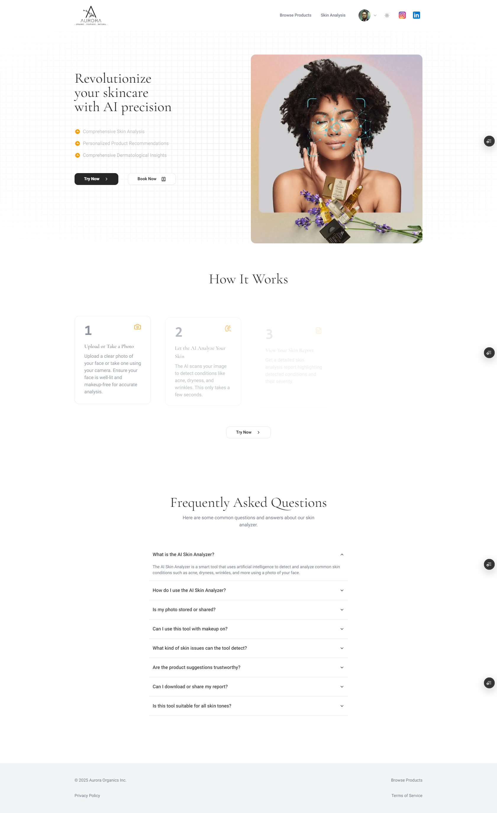

# Aurora Skin Analyzer – Front-End

A modern **Next.js** application (TypeScript) for the Aurora Skin Analyzer project. The UI consumes the Aurora back-end API to predict skin conditions from user-uploaded images and provides a polished dashboard for users, admins, and clinicians.



---

## ✨ Features

| Area              | Highlights                                                                           |
| ----------------- | ------------------------------------------------------------------------------------ |
| **Tech Stack**    | Next.js 15 (App Router) • React 19 • TypeScript • Tailwind CSS 3 • Framer Motion     |
| **Auth**          | Auth.js (NextAuth) with Google OAuth & custom credentials                            |
| **UX**            | Responsive design, dark mode, smooth transitions via motion, adaptive loading states |
| **CI / CD**       | GitHub Actions (build - lint - test) → Docker image → registry                       |
| **Container**     | Multi-stage Dockerfile for slim, production-ready image                              |
| **Testing**       | Jest • React Testing Library • Playwright e2e                                        |
| **Linting / Fmt** | ESLint (next/core-web-vitals) • Prettier • Husky + lint-staged                       |

---

## 📂 Project Structure (simplified)

```
├── app/                 # App Router pages & layouts
│   ├── (auth)/          # OAuth routes (Auth.js)
│   ├── dashboard/       # Protected routes
│   └── ...
├── components/          # Reusable UI components
├── hooks/               # Custom React hooks
├── lib/                 # API client, helpers, constants
├── public/              # Static assets
├── styles/              # Tailwind base & component layers
├── tests/               # Unit & integration tests
├── .env.example         # Environment variable template (see below)
├── Dockerfile           # Multi-stage production build
└── next.config.mjs      # Next.js configuration
```

---

## 🛠️ Environment Variables

Copy `.env.example` → `.env.local` for local dev or `.env.production` for Docker deployments, then fill in the required values:

```env
# JWT secret for Auth.js
AUTH_SECRET="<your-auth-secret>"

# Back-end base URL (Hugging Face Space / API Gateway)
NEXT_PUBLIC_BASE_URL="https://your-backend-host/api/v1"

# Google OAuth credentials
AUTH_GOOGLE_ID="<your-google-client-id>"
AUTH_GOOGLE_SECRET="<your-google-client-secret>"
```

> **⚠️ Never commit real secrets.** The values above **must** be provided at runtime via CI/CD secrets or your hosting dashboard (Vercel, Render, Cloud Run, etc.).

---

## 🚀 Getting Started Locally

```bash
# 1️⃣ Install dependencies
npm install --legacy-peer-deps

# 2️⃣ Run dev server
npm run dev       # http://localhost:3000
```

The first run triggers Tailwind JIT compilation; hot-reloading is enabled.

---

## 🐳 Docker (Production)

Make sure to provide a `.env.production` file in the root directory with all required environment variables.

```bash
# Build image
docker build -t aurora/skin-analyzer-fe .

# Run container
docker run -p 3000:3000 --env-file .env.production aurora/skin-analyzer-fe
```

The app listens on **:`3000`** by default (see `PORT` option in the Dockerfile).

---

## 🧪 Test Suite

```bash
# Unit & integration
npm test

# Component stories
npm run storybook

# End-to-end
npm run e2e      # Playwright
```

---

## 🛣️ CI/CD Pipeline (GitHub Actions)

1. **Push** → Lint & type-check
2. **Build**: `next build && next export`
3. **Docker**: Multi-stage image pushed to GHCR / Docker Hub
4. **Deploy**: Trigger platform of choice (Vercel, Fly.io, Cloud Run)

Secrets are injected via repository settings, not stored in code.

---

## 🤝 Contributing

1. Fork & clone
2. `git switch -c feat/your-feature`
3. Follow `npm run lint` & commit guidelines (`commitlint`)
4. Pull Request – one feature per PR please 🫶🏾

---

## 📝 License

This project is licensed under the **MIT License** – see [`LICENSE`](LICENSE) for details.

---

### 📧 Contact

Need help? Open an issue or reach out to **@wyasyn** on GitHub.

> Built with ❤️ & rich melanin harmony.
